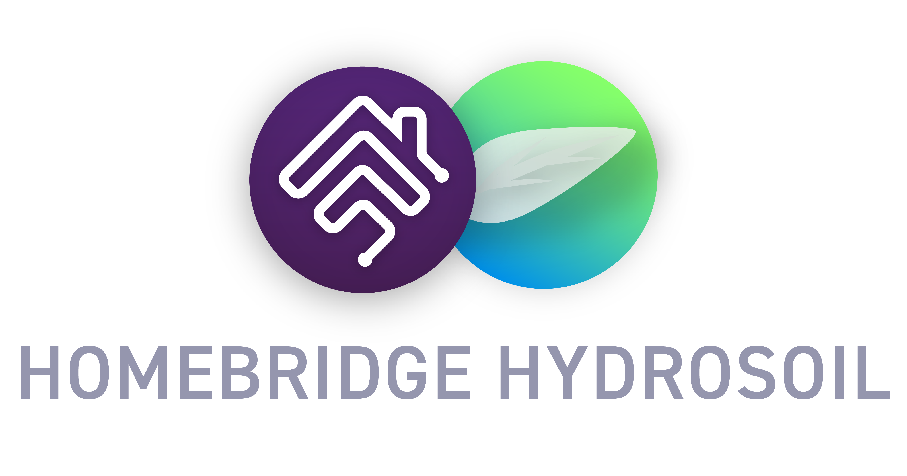

<p align="center">

</p>

# homebridge-hydrosoil
Homebridge HydroSoil allows you to control your HydroSoil sensors and HydroSoil Control Unit through Apple HomeKit and the iPhone/iPad Home app, or your favourite HomeKit third-party client. Easily check up on the status of your irrigation valves and get alerted when HydroSoil sensors detect your plants need to be watered through Apple Home, and integrate your HydroSoil devices with the rest of your smart home.

# Homebridge Installation
**If you don't already have Homebridge installed, please read below**

You will need Homebridge installed to be able to run this plugin. Homebridge is a service allowing you to connect devices to Apple HomeKit. It can be installed on to run in the background on a desktop Mac, desktop Windows machine or IOT device such as a Raspberry Pi. The device you run it on must always be on and located in your house (i.e. a desktop computer not a laptop). It only takes a few clicks to install. Follow the simple installation instructions [on the Homebridge GitHub Wiki here](https://github.com/homebridge/homebridge/wiki). Once installed, use the Homebridge instructions to login to the web interface and scan the QR code using Apple Home app on iPhone/iPad to register Homebridge.

# HydroSoil Plugin Installation
To install the Homebridge HydroSoil plugin, go to the command line app of the device you installed Homebridge on (Terminal on Mac and Linux/Raspberry Pi, Command Prompt on Windows) and paste this command before pressing enter:
```
npm i -g https://github.com/BlaT2512/homebridge-hydrosoil
```

# Setup
Login to the Homebridge Web Interface and go to Plugins > homebridge-hydrosoil > Settings. Enter your HydroSoil username and password (same for HydroSoil Web Interface and HydroSoil app), as well as select the devices you want exposed to Apple HomeKit. For example, if you would like to only control your irrigation valves through Apple HomeKit select the checkbox next to only valves. Simply restart Homebridge after this setup and see your selected HydroSoil devices in Apple Home ready for control!
